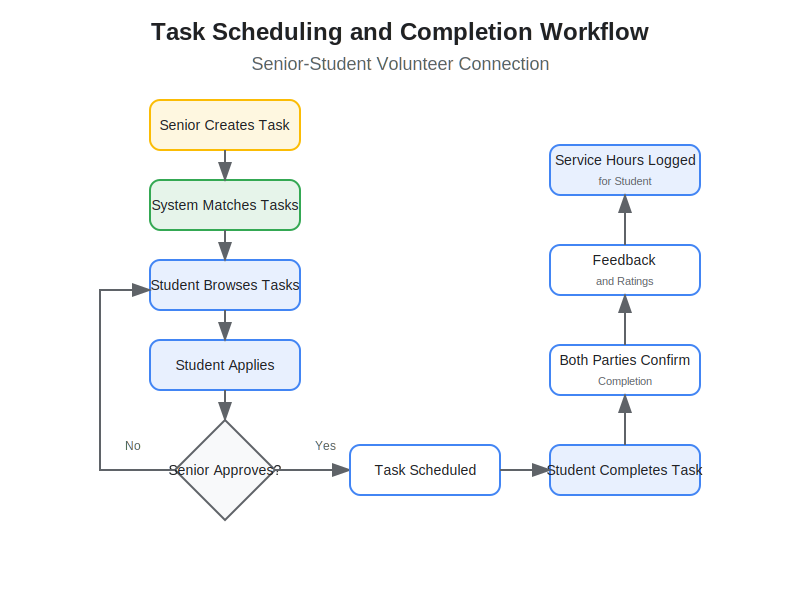

# Senior-Student Volunteer Connection
## Bridging Generations Through Service

---

## Problem Statement

- Seniors often need assistance with daily tasks and chores
- High school students need volunteer hours for college applications
- Existing volunteer matching lacks efficiency and reliability
- Limited opportunities for intergenerational connections

---

## Our Solution

A web-based platform that:
- Connects high school students with seniors in their community
- Facilitates task matching based on needs and capabilities
- Provides reliable scheduling and verification
- Creates meaningful intergenerational relationships

---

## User Journey Map

Our platform provides a seamless experience from discovery to follow-up for both seniors and students.

---

## Registration and Account Flow

1. Users register as either students or seniors
2. Both create detailed profiles with relevant information
3. Verification ensures safety and reliability

---

## Task Creation and Completion Flow

1. Seniors post tasks they need help with
2. Students browse and apply for tasks
3. Seniors approve student applications
4. Tasks are completed and verified
5. Both parties provide feedback

---

## Data Model

Our application is built on a robust database schema that supports all user interactions.

---

## Features for Students

- Easy-to-use task discovery
- Flexible scheduling around school commitments
- Verified service hour tracking for college applications
- Feedback and ratings to build a strong volunteer record
- Opportunities to develop real-world skills and relationships

---

## Features for Seniors

- Simple interface to post help requests
- Ability to review and select student volunteers
- Reliable scheduling and communication tools
- Feedback system to recognize helpful students
- Meaningful social connections with younger generation

---

## Technical Architecture

**Backend:**
- FastAPI (Python)
- SQLite database
- SQLAlchemy ORM
- JWT authentication

**Frontend:**
- React with hooks
- Context API for state management
- Mobile-responsive design
- Axios for API communication

---

## Security & Trust

- Comprehensive user verification
- Parent/guardian consent for student volunteers
- Emergency contact information
- In-app messaging for safe communication
- User rating and feedback system

---

## Impact

- **For Students:** Meaningful volunteer opportunities, skill development, community connections
- **For Seniors:** Assistance with daily tasks, reduced isolation, intergenerational relationships
- **For Communities:** Stronger social bonds, leveraging untapped volunteer potential

---

## Next Steps

- Beta testing with local high schools and senior centers
- Mobile app development
- Community partnerships
- Feature expansion based on user feedback

---

## Join the Movement

Help us connect generations through service!

**Contact:** hello@senior-student-connect.org

---

## Thank You

Questions?